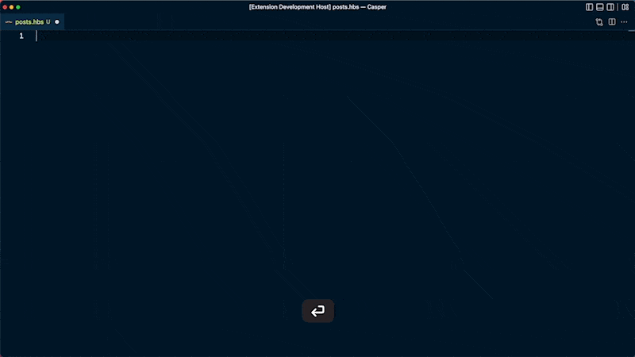
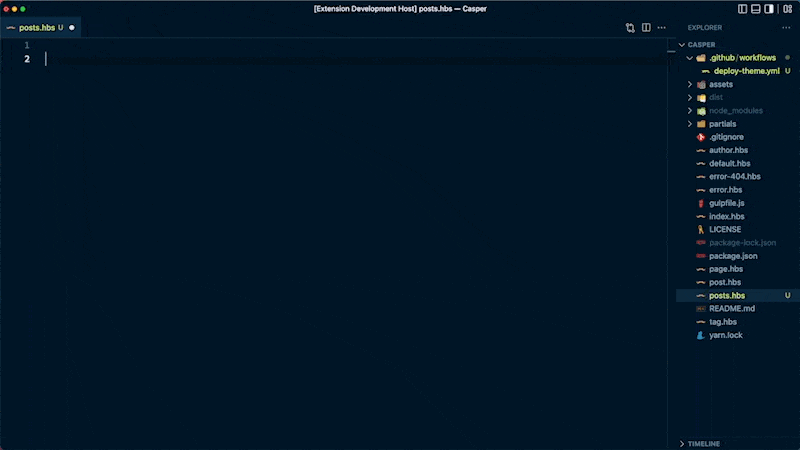
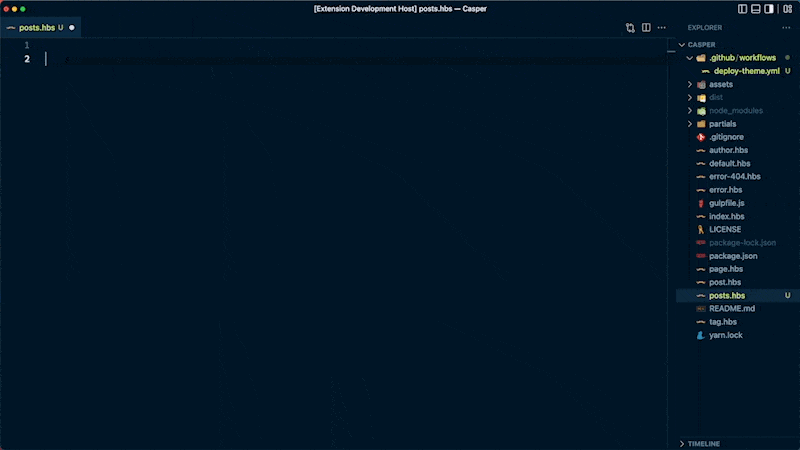
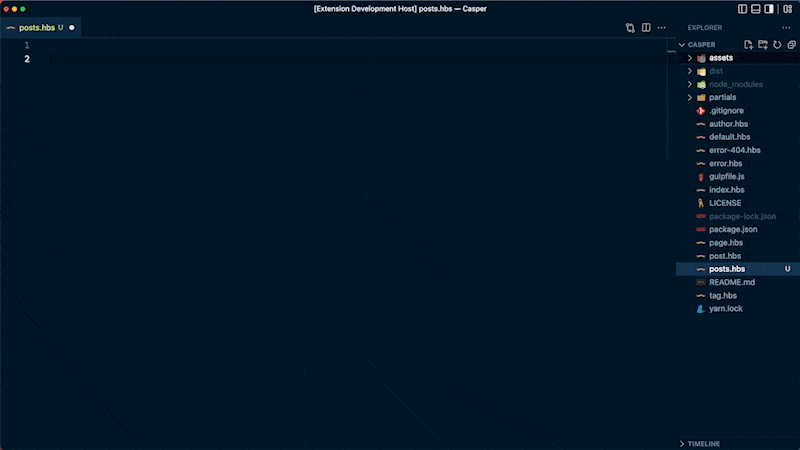

# Ghost

 The ultimate tool for developing themes for the open-source publishing platform [Ghost](https://ghost.org/). 

 New to Ghost theme development? Check out these resources:
 * [Developer documentation](https://ghost.org/docs/)
 * [Tutorials](https://ghost.org/tutorials/)
 * [Source code for the official default Ghost theme, Casper](https://github.com/TryGhost/Casper)

## Features

### Hover for info
Hovering over Ghost theme syntax provides info about what the code does and a link to get more information.


### Autocomplete
Just start typing and the extension will do the rest by autocompleting your Ghost theme helper.


#### Available snippets
- `asset`
- `custom`
- `foreach`
- `get`
- `has`
- `if`
- `img:formats`
- `img:responsive`
- `img_url`
- `is`
- `partials`
- `plural`
- `post`
- `price`
- `site`
- `unless`


### Dynamic autocomplete

This extension also provides three dynamic autocomplete functions that reads data from your theme configuration (`package.json`).


- `custom`: generates a list of your custom properties for easy autocompetion
- `img:responsive`: generates a responsive image srcset based on your theme's configured image sizes
- `img:formats`: generates a responsive image srcset but also includes sytnax for converting image formats

### Help
Use the `Ghost search` command to search theme documentation and open the official page in a browser.



### Gscan
Use the `Gscan` command to scan your Ghost theme for errors. Errors and recommendations are output in a VS Code terminal window.



> If `Gscan` is not installed, you'll be prompted to install it before it runs.

### GitHub Deploy Theme Action
Use `Ghost Github Action` to add the GitHub Deploy Action to your theme.




> Tip: After adding the deploy script, set up your custom integration on your Ghost site and and add your secrets to GitHub. [Read the docs for more info](https://github.com/TryGhost/action-deploy-theme)
## Requirements

Open your theme as the root folder in VS Code.


## Release notes

- Initial release 🎉

### 1.0.0

Initial release of **Ghost Theme Development Helper**

## Tips & Tricks
- For autocomplete, write Handlebar helpers without curly braces (`{{``}}`). For example, write `foreach` not `{{foreach}}`
- With autocomplete, use `tab` to advance your cursor
- To use autocomplete options within other autocomplete syntax (like using `custom` with `match`), add the following in your VS Code `settings.json` file:
```json
  "editor.suggest.snippetsPreventQuickSuggestions": false
```

## Development
See [`CONTRIBUTING.md`](CONTRIBUTING.md) for more developing this extension.